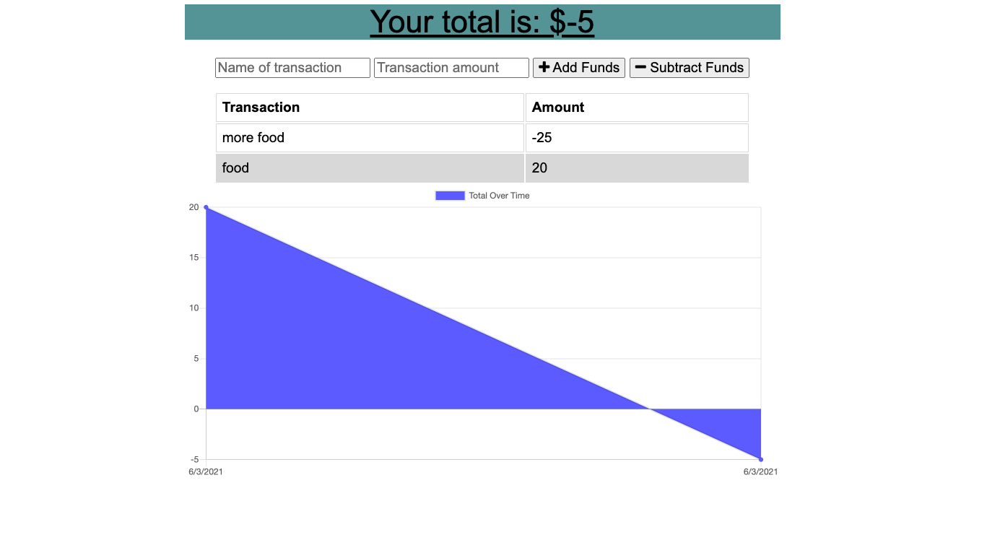

# Employee Directory

## Links:

Github: https://github.com/Yeatman51

Repository: https://github.com/Yeatman51/budget-tracker-pwa

Live Demo: https://budget-tracker-pwa-jy.herokuapp.com/

---

## Description:

This budget tracker utilizes mongo DB to store user Inputted data. This user data is then charted below and for an added visual there is a graph that will dynamically display as new data has been saved to the application.

This application also utilizes the PWA structure so The user is able to continue to add new data points when you were off-line.

